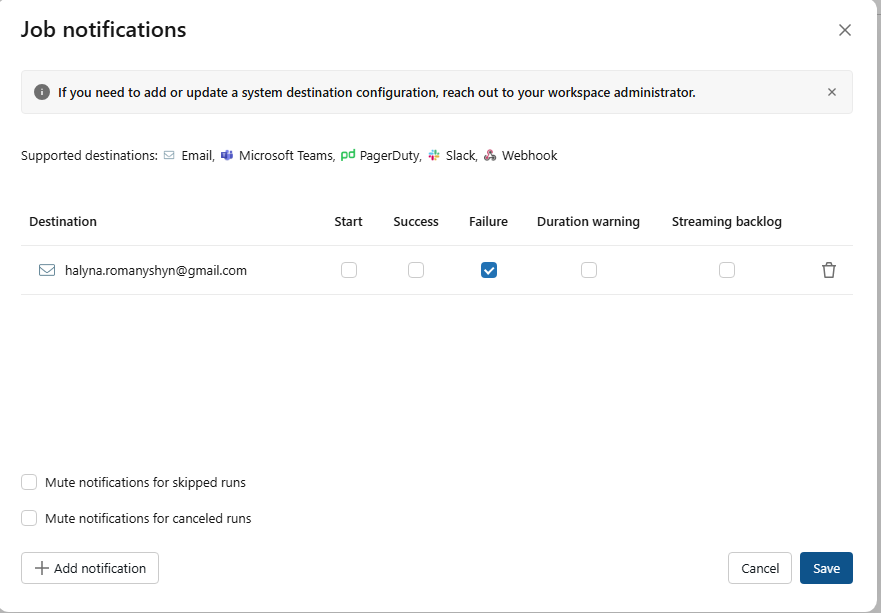

I completed the following optional bonuses:

- [x] Easy — Workflows alerting
- [x] Medium — Governance
- [x] Harder — Structured Streaming
- [ ] Harder+ — Local PySpark module and pytest

## Easy — Workflows alerting

I configured an email notification for failures of the
`dev_halyna_fct_trips` Databricks Job.

This notification allows pipeline failures to be detected automatically without
manually checking the Databricks Jobs page after every scheduled run.



## Medium — Governance

### Table privileges

I inspected the access privileges for the table
`hyf.dev_halyna.fct_trips` using the following SQL command:

```sql
SHOW GRANTS ON TABLE hyf.dev_halyna.fct_trips;

The result shows the privileges visible to my current Databricks identity. The
displayed privileges are inherited from the hyf.dev_halyna schema.

## Unity Catalog lineage

I inspected the Unity Catalog lineage graph for
hyf.dev_halyna.fct_trips.

The graph shows that the final fct_trips table depends on the upstream dbt
models:

stg_trips
stg_zones

This lineage information helps identify where the data came from and which
upstream objects affect the final analytical table.

## Example PII tag

The following statement shows how a hypothetical customer e-mail column could
be tagged as sensitive personally identifiable information:

ALTER TABLE hyf.dev_halyna.fct_trips
ALTER COLUMN hypothetical_customer_email
SET TAGS (
  'pii' = 'true',
  'classification' = 'sensitive'
);

This command was documented but not executed because
hypothetical_customer_email is not a real column in the fct_trips table.

## Harder — Structured Streaming

I created a Databricks notebook and used the Spark rate source to generate
streaming rows.

The source generated five rows per second. Each generated record contained:

timestamp
value

I also added a derived column:

value_squared

The streaming output was written to the following Delta table:

hyf.dev_halyna.rate_stream_demo

A Unity Catalog Volume was used for the Structured Streaming checkpoint because
the public DBFS root was not available in the shared workspace.

## Streaming dashboard

The streaming dashboard showed the input rate, processing rate, and micro-batch
duration while the streaming query was active.

## Delta table result

During the demonstration, the stream generated 2,185 rows. The resulting Delta
table contained the generated timestamp, value, and value_squared
columns.

## Stopping the stream

After verifying the result, I explicitly stopped the streaming query:

query.stop()

I confirmed that the query was no longer active:

Streaming query active: False

Stopping the query was important because an active streaming process would
continue generating data and consuming shared compute resources.

I also stopped the idle Spark compute after completing the streaming
demonstration.

## Harder+ — Local PySpark module and pytest

I created a local PySpark project containing two pure transformation functions:

calculation of trip counts by pickup borough;
calculation of the average total_amount by payment_type.

The project also contains pytest tests based on small local fixture DataFrames.
The tests do not read Unity Catalog tables and do not connect to Databricks.

The local project structure was created successfully, and the required Python
dependencies were installed. However, the tests were not completed successfully.

PySpark requires a local Java Development Kit because the Apache Spark engine
runs in the Java Virtual Machine. The local Spark session could not start because
Java was not configured, resulting in this error:

[JAVA_GATEWAY_EXITED] Java gateway process exited before sending its port number.

Because there is no successful green pytest result, I do not claim this bonus
as completed.